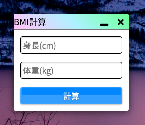
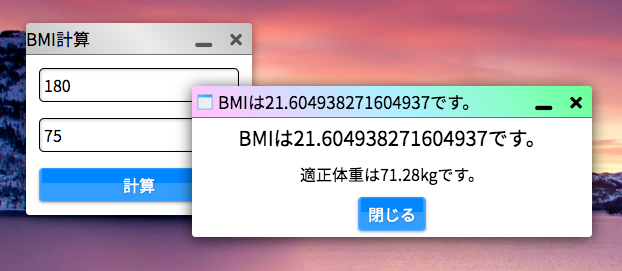

# はじめてのkitアプリ

いよいよ、はじめてのkitアプリケーションを作ってみましょう。

簡単な「BMIを計算するアプリケーション」を作ってみましょう。まずは、`/app`以下に`bmi`という名前のディレクトリを作成します。

> ここで作成したディレクトリの名前が**アプリのID**となります。

## define.jsonを作る

kitアプリケーションに必須である**define.json**を、アプリケーションディレクトリの直下に以下のような内容で配置します。

```define.json
{
    "id": "bmi",
    "name": "BMI計算",
    "icon": "none",
    "version": "1",
    "author": "authorName",

    "support": {
        "darkmode": true,
        "resize": false,
        "fullscreen": false
    },

    "size": {
        "width": "auto",
        "height": "auto"
    },

    "view": "default.html",
    "script": "bmi.js",
    "css": "none"
}
```

define.jsonの内容を変更することでアプリの名前やバージョン情報を自由に定義できます。define.jsonの書き方についての詳細は[こちら](DEF)を参照してください。

重要なのは`view`で定義したファイルがテンプレートとしてロードされ、`script`で定義したJavaScriptファイルが実行されるということです。

## テンプレートを作る

次に、define.jsonで定義した**default.html**にHTMLでアプリを作っていきます。

> このメインのテンプレートのファイル名は何でもいいのですが、慣習的に**default.html**という名前で作る場合が多いです。

BMIを算出する式は、**体重 ÷ (身長)^2**です。体重と身長を入力するフィールドを配置することが考えられます。


```default.html
<input type="text" class="textbox m" placeholder="身長(cm)"><br>
<input type="text" class="textbox m" placeholder="体重(kg)">
<kit-button class="kit-block m">計算</kit-button>
```

2つの`<input>`タグに**kitstrap**の`.textbox`クラスを付与し、スタイルを設定します。そして、`<kit-button>`要素を使って計算ボタンを配置しましょう(ブロック要素にするために`.kit-block`クラスを付与します)。

> `.m`クラスは、要素にmarginを付与します。`.p`クラスは要素にpaddingを付与します。詳細は[kitstrapのドキュメント](https://mtsgi.github.io/kitstrap/docs/layouts.html)をご確認ください。

この時点で、アプリケーションを開いてみる(検索ボックスに「bmi」を入力し、「アプリを起動する」をクリック)と、次のような見た目が完成しているはずです。



ただし、現状ではボタンをクリックしても何も起きません。ここからスクリプトを書くことでBMI計算アプリとしての動作を完成させましょう。

## スクリプトを書く

`define.json`の中でスクリプトとして指定した`bmi.js`というファイルを作ってください。この時点で、アプリのディレクトリの中身は次のようになっているはずです。

```
app
└── bmi
    ├── bmi.js
    ├── default.html
    └── define.json
```

スクリプトとして指定したJavaScriptのコードは、アプリの起動時に自動的に実行されます。

kitアプリのスクリプトの基本形は次の形です：

```bmi.js
((_pid) => {
    //ここにスクリプトを記述
})(pid);
```

kitアプリケーションをスクリプトありで作る場合、毎回このひな形から作り始めましょう。

> これは、アプリの**プロセスID**を引数に取る**即時関数**です。関数スコープを持ち、`_pid`変数を使うことでプロセスIDを使った処理を行うことができます。プロセスIDは、アプリケーションの起動時に割り振られる識別子で、プロセスを判断し操作するのに重要なものです。

実は、ボタンのクリック時のイベントを設定して、`<input>`タグの内容を取得して計算をする処理を書いて…というのは少し面倒ですが、**kit apps framework**(kaf)の機能を使うことでこれらは簡単に実現することができます。

**kaf**を使うことで、JavaScriptコーディングの量を劇的に少なく、あるいはまったくなくすことができます(実際に、`welcome`アプリではJavaScriptによるコーディングは1行もありません)。`default.html`に次のように少し書き加えます。

```default.html
<input type="text" class="textbox m" placeholder="身長(cm)" kit-bind="height"><br>
<input type="text" class="textbox m" placeholder="体重(kg)" kit-bind="weight">
<kit-button class="kit-block m" kit-e="calc">計算</kit-button>
```

2つの`<input>`要素の`kit-bind`属性にそれぞれ`"height"`、`"weight"`という名前をつけます。こうすることで、スクリプトから**App.data()**メソッドを使ってバインドされたデータを取得することができるようになります。

また、`<kit-button>`要素に`kit-e`属性に`"calc"`というイベント名を指定し、ボタンのクリック時に**calc**というイベントが呼び出されるようにします。

> `kit-e="calc"`という記述は、実は`kit-e="calc click"`の省略形です。イベント名のあとに半角スペースを空けてイベント種類(**event.type**。詳細は[こちらの記事](https://developer.mozilla.org/ja/docs/Web/API/Event/type)を参照)を指定することでイベントの実行条件を定義できるのですが、`click`の場合のみ省略できます。

それができたら、スクリプト側で**calc**というイベントを定義しましょう。あと少しで最初のkitアプリが完成します。

```bmi.js
((_pid) => {
    // "calc"というイベントを設定
    App.event(_pid, "calc", ()=>{
        // heightとweightを取得
        let h = App.data(_pid).height;
        let w = App.data(_pid).weight;
        // 数値に変換
        h = Number(h) / 100;
        w = Number(w);
        // 計算
        let BMI = w / (h * h);
        let apt = (h * h) * 22;
        // アラート表示
        System.alert(`BMIは${BMI}です。`, `適正体重は${apt}kgです。`);
    });
})(pid);
```

`App.event()`メソッドでイベントを定義します。第1引数は**プロセスID**(先ほど即時関数の仮引数とした`_pid`を使います)、第2引数は**イベント名**(ここでは`"calc"`)、第3引数に**実行される関数**そのものを記述します。kafのイベントはプロセスごとに管理されるため、他のアプリとのイベント名の重複は気にする必要がありません。

変数`h`と`w`にそれぞれ身長、体重の値を格納します。それを数値に変換し、BMIと適正体重を算出後、システムネイティブの`System.alert()`メソッドを使ってアラートとしてBMIと適正体重を表示するというスクリプトになっています。

## 完成！

これで、はじめてのkitアプリが完成です！実際にアプリを起動してみましょう。



数値を入力して、計算ボタンをクリックするとBMIが算出されるはずです。

さて、kitアプリの作り方が分かったでしょうか。もうあなたは自由にkitアプリを作成できるでしょう。

もしくは、まだ改善点のある`bmi`アプリを改良してみるのもよいでしょう。
