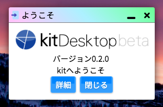

# kitアプリのしくみ

はじめてのkitアプリを作る前に、kitアプリのしくみについて知っておきましょう。kitアプリのしくみはとても簡単です。

kitアプリケーションは基本的に、kitディレクトリ直下の`/app`以下にアプリケーションごとにディレクトリを持つ形で存在しています。

> `/app`以外の場所にあるアプリケーションは、「インストール」をすることで簡単に利用することもできます(これを利用すればインターネット上のディレクトリからkitアプリケーションをロードすることも可能です)。

## ディレクトリ構造

まずは、`/app/welcome`というディレクトリの中を見てみてください。これはデフォルトでkitの起動時に起動する**welcome**というアプリケーションの中身です(使用しているkitのバージョンによっては内容が異なる場合があります)。



ディレクトリは、以下のような構造をしています。**welcome**というアプリケーションはこの**たった4つ**のファイルで動いているということです。

```
app
└── welcome
    ├── default.html
    ├── define.json
    ├── detail.html
    └── icon.png
```

最も重要なのは、`define.json`というファイルです。kitシステムは、アプリケーションをロードするとき最初にアプリのディレクトリ内の`define.json`を参照します。ここにはアプリケーションの情報が記述されています。

## define.jsonについて

**welcome**アプリのdefine.jsonは以下のようになっています。

```define.json
{
    "id": "welcome",
    "name": "ようこそ",
    "icon": "icon.png",
    "version": "1.1.0",
    "author": "kit",

    "size": {
        "width": 300
    },

    "view": "default.html",
    "script": "none",
    "css": ""
}
```

ここにアプリケーションの名前や作者名などの情報が記述されます。それぞれの項目の詳細はここでは省きますが、アプリの起動時に`view`という項目に記述されたファイル(ここでは`default.html`)がアプリの画面(テンプレート)として読み込まれる仕組みです。

> `define.json`の書き方や内容については、[define.json - 定義可能項目の一覧](/DEF)をご確認ください。

## HTMLによるアプリのテンプレート

次に、`default.html`の内容を見てみましょう。kitでは、HTMLを使ってアプリケーションのテンプレートを記述することができます。部分的なテンプレートとして記述するため、`<html>`タグや`<body>`タグ、`<head>`タグは必要ありません。

```default.html
<div class='p kit-text-c'>
    
    バージョン<span kit-text="System.version" kaf></span>
    <br>
    kitへようこそ
    <br>
    <kit-button kaf kit-ref='detail.html'>詳細</kit-button>
    <kit-button kaf kit-close>閉じる</kit-button>
</div>
```

たったこれだけのHTML記述でこのような見た目のアプリケーションを作成することができるのです。


ここで指定されている`class`属性は、CSSフレームワーク**kitstrap**のものです。`kit-`から始まる属性は**kit apps framework**(kaf)によるアプリケーションの動作定義です。

これらの標準実装のおかげで、簡単に、ほとんどコーディングすることなくkitアプリケーションのテンプレートを作成、動作を定義することが可能になっています。詳細や使い方は次の章で紹介します。
