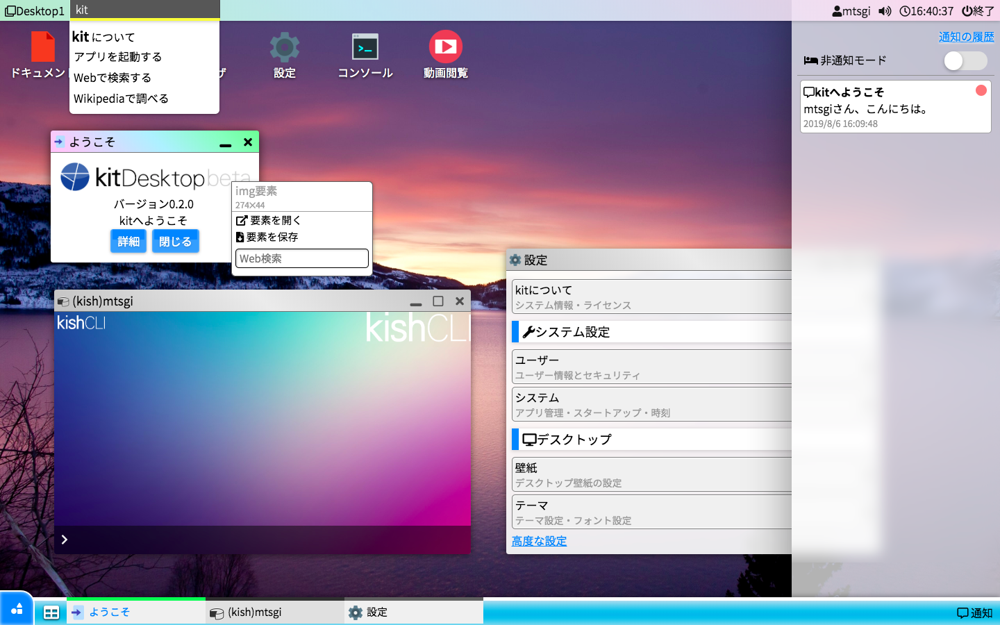

# kitDesktopとは？

kitDesktopはインストール不要でJavaScript上で完全に動作するオープンソースのデスクトップ環境です。

すべてのkitアプリケーションは**HTML**構造に**JavaScript**、それとJavaScriptを用いた**kit apps framework**を用いて記述されていて、呼び出されるとAjaxでロードされます。サーバーサイド技術は用いられていません。

> kitアプリケーションはHTMLと少しのJavaScriptの知識があればすぐに開発することができます。CSSを記述してアプリケーションのスタイルを調整することも可能ですが、kitのスタイルフレームワークである**kitstrap**を使用するともっと簡単にアプリケーションのスタイルやレイアウトを組み立てることができます。

まずは、[最新安定版](http://kitit.ml/)のkitを体験してみてください。

このkitシステムをローカル環境にダウンロードして使用すれば、オフラインで動作可能で、高速なアプリケーションのロードが可能で、簡単にkitアプリケーション開発を行うことができます。
