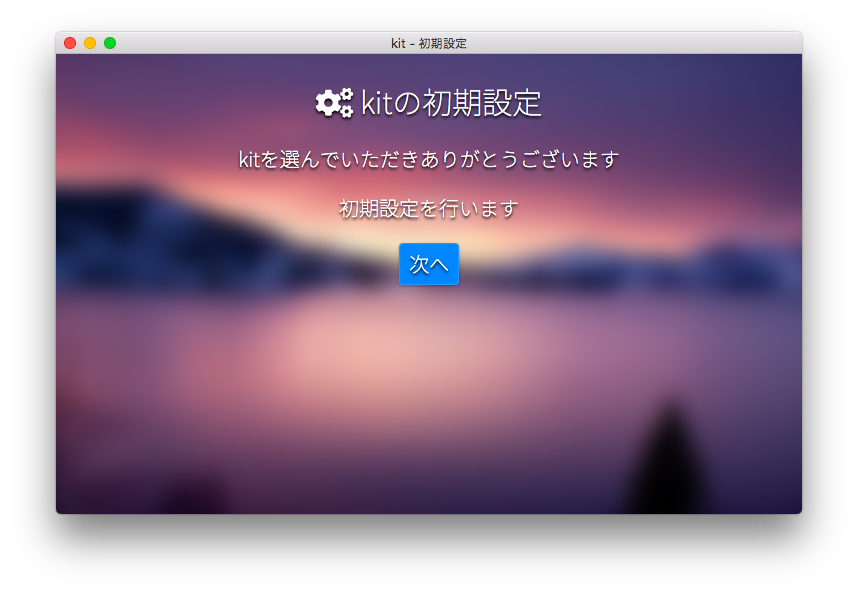

# kitをはじめる

kitを便利に使用するなら、ローカル環境にkitDesktopをダウンロードしましょう。

kitをあなたのコンピュータのローカル環境に取得するには、2通りの方法があります。

### [方法1] ZIPからダウンロードして展開

次のどちらかのページからkit本体のzipファイルをダウンロードし、kitを配置したいディレクトリに展開します。

> #### [リリース一覧からダウンロード](https://github.com/mtsgi/kit/releases)

> #### [安定前の最新版をダウンロード](https://github.com/mtsgi/kit/archive/master.zip)

### [方法2] GitHubリポジトリをクローン

kitを配置したいディレクトリに移動して、次のコマンドを実行します(事前にgitのインストールが必要です)。
```
git clone https://github.com/mtsgi/kit.git
```

## kitを起動してみる

kitDesktopはクライアントサイドで動作するシステムなので、今kitを配置したディレクトリ内の`autorun.html`のパスをブラウザのアドレスバーに入力すれば、kitDesktopは起動します。最初の起動時には「初期設定」が自動的に実行されます。



初期設定はすぐに終わります。kitがアプリケーションが展開できない場合、以下の対応を試みてください。

## 同一生成元ポリシーへの対応

ローカルディレクトリ内でkitを展開している場合、同一生成元ポリシーによりajax要求が成立しない場合があります。この場合、デスクトップのアプリケーションショートカットの読み込みや一切のアプリケーションの起動など主要なkitシステム機能の多くがブロックされます。

### Blink
ブラウザエンジンの起動時に引数`-allow-file-access-from-files`を渡す必要があります。

または、**Flags**の項目`out-of-blink-cors`を有効化することで永続的にポリシーを緩和します。

### Gecko

Firefox 68以上のバージョンでは`file:///`URI内で要求を行う場合、設定([about:config](about:config))の項目`privacy.file_unique_origin`を`false`にする必要があります。

- 詳細: https://developer.mozilla.org/en-US/docs/Web/HTTP/CORS/Errors/CORSRequestNotHttp

## HTTPサーバーを用いて起動する

例えば、**python**には、HTTPサーバー機能がついています。

```
python -m http.server 8000
```

このコマンドをkitのディレクトリで実行することで(事前にpythonのインストールが必要です)、`http://localhost:8000/`からkitDesktopを起動できます。この方法では、上記の同一生成元ポリシーの影響を受けません。
