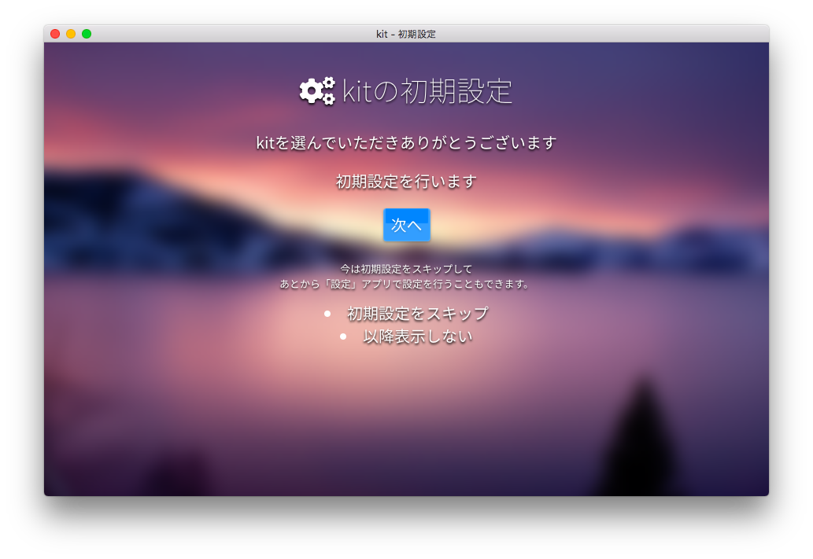

# kitをはじめる

kitを便利に使用するなら、ローカル環境にkitDesktopをダウンロードしましょう。

kitをあなたのコンピュータのローカル環境に取得するには、2通りの方法があります。

### [方法1] ZIPからダウンロードして展開

次のどちらかのページからkit本体のzipファイルをダウンロードし、kitを配置したいディレクトリに展開します。

> #### [リリース一覧からダウンロード](https://github.com/mtsgi/kit/releases)

> #### [安定前の最新版をダウンロード](https://github.com/mtsgi/kit/archive/master.zip)

### [方法2] GitHubリポジトリをクローン

kitを配置したいディレクトリに移動して、次のコマンドを実行します(事前にgitのインストールが必要です)。
```
git clone https://github.com/mtsgi/kit.git
```

## kitを起動してみる

kitDesktopはクライアントサイドで動作するシステムなので、今kitを配置したディレクトリ内の`autorun.html`のパスをブラウザのアドレスバーに入力すれば、kitDesktopは起動します。最初の起動時には「初期設定」が自動的に実行されます。



初期設定はすぐに終わります。

> Windows環境をお持ちの場合、ディレクトリ内の`kit.lnk`ショートカットをデスクトップなどに配置するとワンクリックで起動することができます(一度ブラウザを閉じてからクリックしてください)。

## 同一生成元ポリシーへの対応

ローカルディレクトリ内でkitを展開している場合、同一生成元ポリシーによりajax要求が成立しない場合があります。この場合、デスクトップのアプリケーションショートカットの読み込みや一切のアプリケーションの起動など主要なkitシステム機能の多くがブロックされます。

この問題への対処方法が、次のページに記載されていますので対応を試してみてください。

- [アプリが起動しない](/cors)
