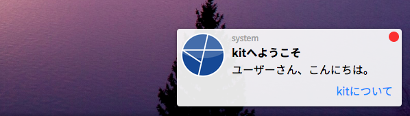

# _app.ntfメソッド

アプリケーションから通知を送信します。通知にはタイトルやテキストのほか、画像や複数のボタンを設定することができます。

## 書式

```javascript
_app.ntf( title, content[, action, img, buttons] )
```

- **title** (string/必須)
  - 通知のタイトルです。表示上は太字のテキストとして表現されます。

- **content** (string/必須)
  - 通知の内容です。通知としてユーザーに伝えたい内容を記述します。

- **action** (function)
  - 通知ペインをクリックした際のイベントを設定できます。省略した場合、または`null`の場合はデフォルトの通知クリック動作として該当プロセスのウィンドウを最前面に表示します。

- **img** (string)
  - 通知に付加する画像のパスです。

- **buttons** (array)
  - 通知に設定するボタンの設定を1つ以上含む配列です。

## 説明

`_app.ntf`メソッドは、kitシステムまたはアプリケーションがユーザーに対して通知を送るための汎用的な手段である[Notification.pushメソッド](/Notification.push)メソッドをアプリプロセス用にラップしたメソッドです。

kitの通知システムは、ユーザーに以下のような通知を送信します。



画像の例では、「**kitへようこそ**」が`title`、「**ユーザーさんこんにちは。**」が`content`に該当します。

通知ペインのクリック時のアクションはデフォルトでは”該当プロセスを最前面に移動”([KWS.frontメソッド](/KWS.front)を呼び出します)ですが、`action`引数にメソッドを渡すことで、この挙動を上書きできます。

通知に付与できる画像は、最大サイズを超過する場合は自動的に縮小されます。

`buttons`引数には、`label`キー(string)と`func`キー(function)を持つオブジェクトの配列を渡すことで1個以上のボタンを通知に付与することができます。詳細は次の例をご覧ください。

## 例

```javascript
_app.ntf( message.user.name, message.content, () => {
    launch('testmessenger', { openId: message.id })
    , message.user.icon, [ {
        label: '返信',
        func: () => {
            _app.e().reply(message.id)
        }
    },
    {
        label: '通知をオフ',
        func: () => {
            _app.e().turnPushing(message.roomId, true)
        }
    } ]
} )
```

架空のメッセージングアプリケーションで、トークルームへのメッセージを知らせる通知に返信機能と通知を切る機能を持つボタンを付加する例です。

アプリ内のオブジェクト名やメソッド名は実在するものではありませんが、_app.eオブジェクトに引数を取るreply()やturnPushing()メソッド、messageオブジェクトにメッセージのトークルーム情報、送信元情報などが含まれているものと仮定しています。

> このメソッドは、kafが内部的に[Notification.push](/Notification.push)メソッドを呼び出しています。
