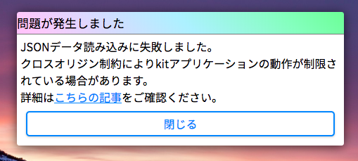

# アプリが起動しない

すべてのkitアプリケーションのロードに失敗するような場合、ブラウザの同一生成元ポリシーによってjsonファイルの読み込みがブロックされている場合があります。kit v0.2.1以降では、jsonファイルの読み込みができない場合、次のようなエラーが表示されます。



## 同一生成元ポリシーへの対応

ローカルディレクトリ内でkitを展開している場合、同一生成元ポリシーによりajax要求が成立しない場合があります。この場合、デスクトップのアプリケーションショートカットの読み込みや一切のアプリケーションの起動など主要なkitシステム機能の多くがブロックされます。

### Blink
ブラウザエンジンの起動時に引数`-allow-file-access-from-files`を渡す必要があります。

> kitに同梱されている`kit.lnk`ショートカットは、起動時に自動的にこの引数を付与するようになっています(ショートカットにkitディレクトリの正しいパスを入力する必要がある場合があります)。

または、**Flags**の項目`out-of-blink-cors`を有効化することで永続的にポリシーを緩和します。アドレスバーに`chrome://flags`を入力して検索することで有効化できます。

### Gecko

Firefox 68以上のバージョンでは`file:///`URI内で要求を行う場合、`about:config`の項目`privacy.file_unique_origin`を**false**にする必要があります。

- 詳細: https://developer.mozilla.org/en-US/docs/Web/HTTP/CORS/Errors/CORSRequestNotHttp

## HTTPサーバーを用いて起動する

例えば、**python**には、HTTPサーバー機能がついています。

```
python -m http.server 8000
```

このコマンドをkitのディレクトリで実行することで(事前にpythonのインストールが必要です)、`http://localhost:8000/`からkitDesktopを起動できます。この方法では、上記の同一生成元ポリシーの影響を受けません。

